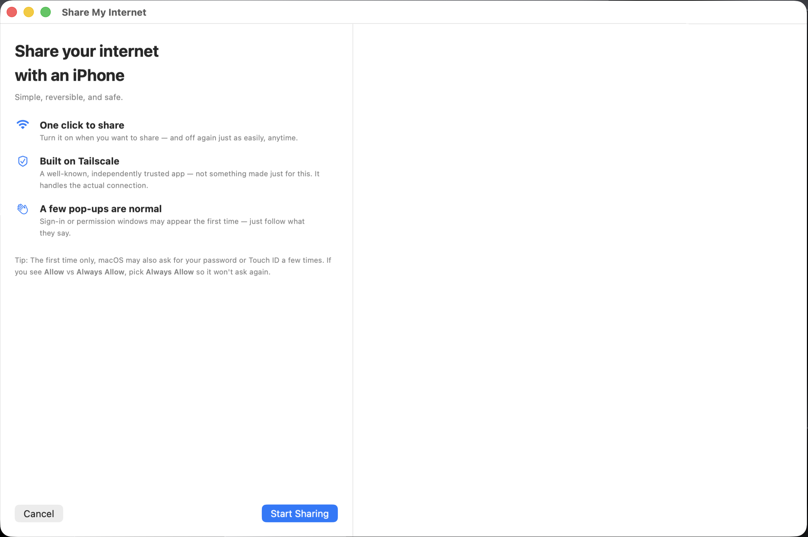
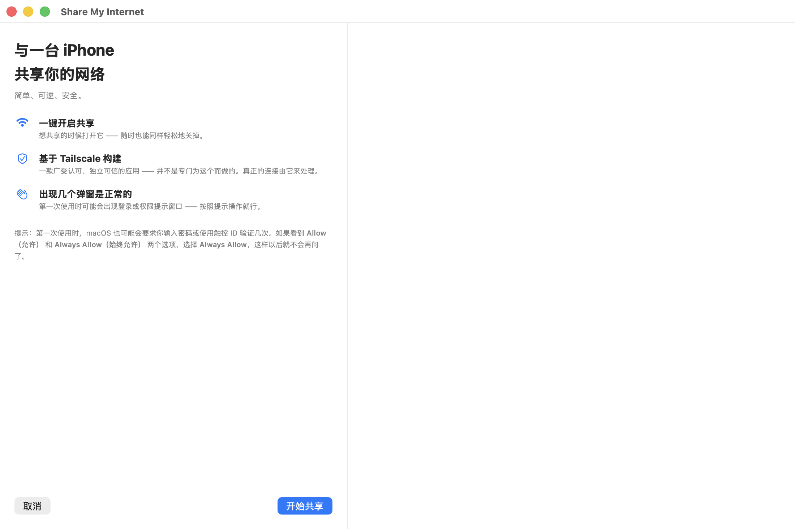
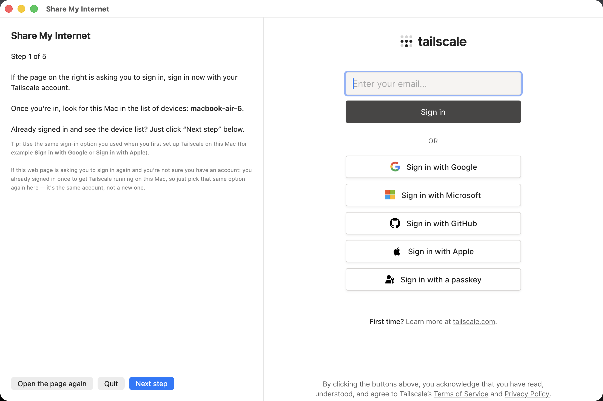
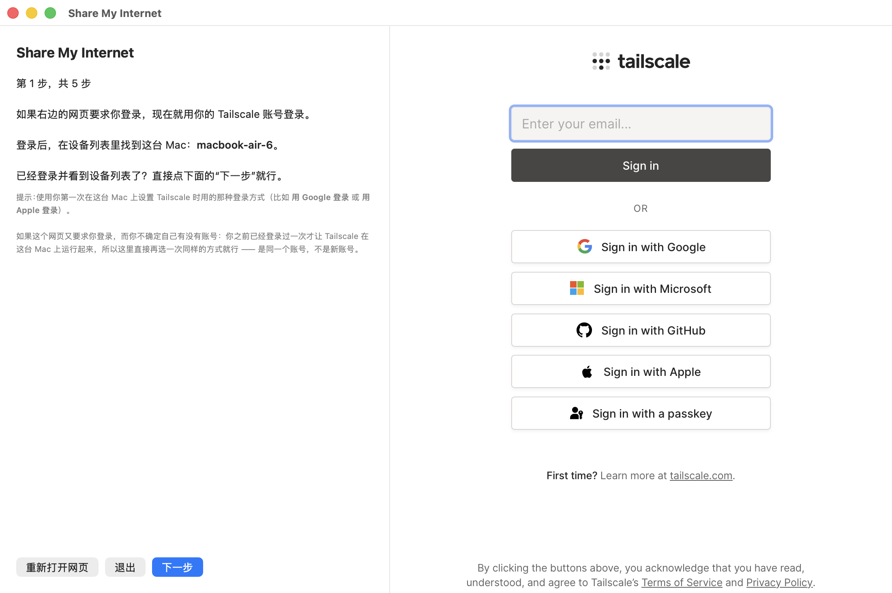

# Share My Internet

Let someone else get online from their iPhone, using your Mac's internet connection — no router config, no hotspot fiddling, no technical knowledge required on either end.

Built for one specific scenario: a non-technical person (on either side of the exchange) just wants their internet to work. Every screen is written in plain language, walks through one step at a time, and tells you when something unusual (but normal) is about to happen — like a password prompt — before it happens.

Under the hood it's powered by [Tailscale](https://tailscale.com) (free, independently trusted — not something built for this project) acting as a VPN exit node. This app is just a friendly front end around Tailscale's CLI and web admin console.

Available in English and 中文 — pick a language the first time you open the app.

<table>
<tr><th>English</th><th>中文</th></tr>
<tr>
<td></td>
<td></td>
</tr>
</table>

## Download

Grab the signed, notarized `.dmg` from the [Releases page](../../releases/latest) — no Gatekeeper warnings, just open and drag to Applications.

## How it works

1. Open **Share My Internet** on the Mac that will share its internet connection.
2. It checks Tailscale is installed and signed in — if not, it walks you through that first, waiting and re-checking rather than making you restart the app.
3. It turns on exit-node sharing and walks you through the one-time Tailscale website setup (approving the device, generating a share link) — right inside the app, in an embedded browser pane next to the instructions, so you're never jumping between windows.
4. It builds a ready-to-paste message for the other person and copies it to your clipboard — just paste it into Messages, WhatsApp, WeChat, whatever you use to talk to them.
5. They follow the message's steps on their iPhone (install Tailscale, tap your invite link, pick your Mac as the exit node) and they're online.
6. Click **Stop Sharing** whenever you're done — it turns the exit node back off and confirms on screen that it actually happened.

Step 3 in practice — instructions and the live Tailscale page side by side, no window-switching:

<table>
<tr><th>English</th><th>中文</th></tr>
<tr>
<td></td>
<td></td>
</tr>
</table>

## What's in this repo

| Path | What it is |
|---|---|
| `native/ShareMyInternetBeta/` | **The app** — a native SwiftUI/AppKit app with an embedded browser pane, step-by-step guided flow, and a live preview of the message before it's sent. This is what ships in Releases. |
| `legacy/applescript/` | An earlier AppleScript-based implementation (packaged as a double-clickable `.app`). Kept for reference — no embedded browser, dialog-box UI. |
| `legacy/command/` | An earlier terminal-based (`.command`) implementation. Kept for reference. |

The native app and both legacy versions share the same underlying shell helper (`core.sh` + `watchdog.sh`) that talks to the `tailscale` CLI — turning exit-node sharing on/off, checking sign-in state, and keeping the Mac awake with a quiet background reconnect loop while sharing is active.

## Building from source

Requires Xcode (for the Swift toolchain) and a free or paid Apple ID for local codesigning.

```bash
cd native/ShareMyInternetBeta
swift build -c release --arch arm64 --arch x86_64   # universal binary

# Then assemble into a .app bundle — see scripts/release_macos.sh for the
# full build → sign → DMG → notarize pipeline (notarization requires a paid
# Apple Developer account; everything up through local signing works without one).
```

For local testing without a Developer ID certificate, ad-hoc signing works fine:

```bash
codesign --force --deep -s - "Share My Internet.app"
```

## Requirements

- macOS 13 or later
- [Tailscale](https://tailscale.com) (free) — the app will prompt you to install it if it isn't already
- A Tailscale account — created automatically the first time you sign in, no separate sign-up needed

## Privacy & security

- This app only talks to the official `tailscale` CLI already installed on your Mac — it doesn't handle your credentials or network traffic itself.
- The embedded browser pane in the native app points only at `login.tailscale.com`, Tailscale's own admin console.
- Nothing here collects analytics, telemetry, or personal data.

## License

MIT — see [LICENSE](LICENSE).
